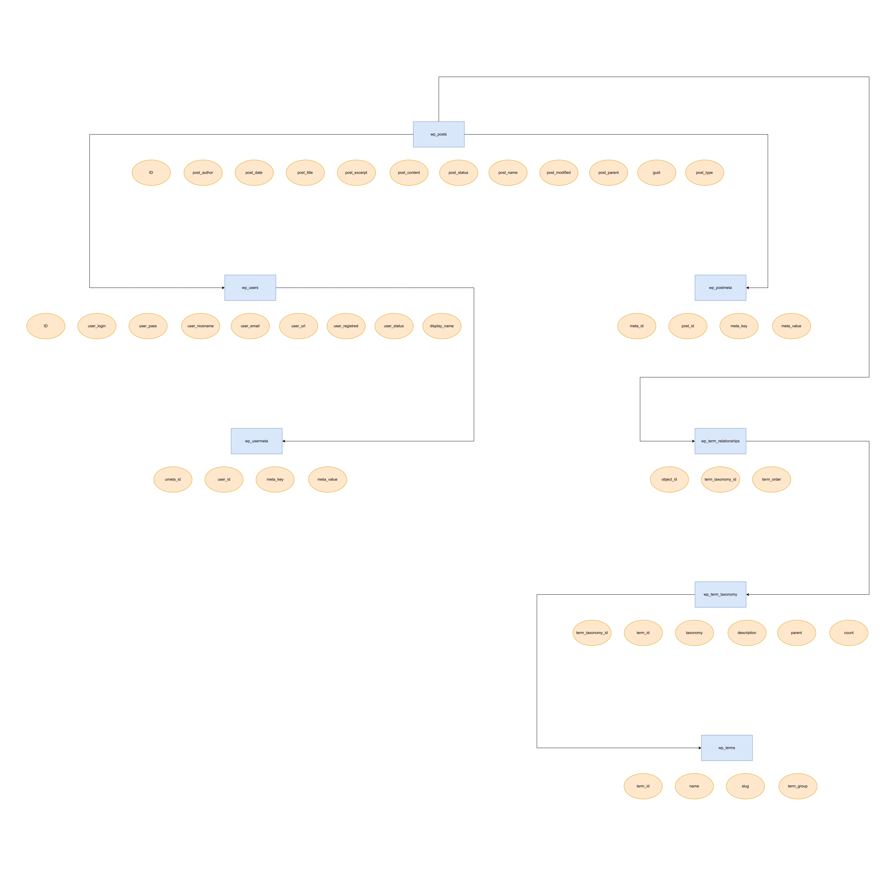

## Template Hierarchy from Official Site of WordPress

## Basic Entity Relationship Diagram
    
Note: I only added the relevant table for me. So this ER diagram does not have the comment table, since I don't really use the comment feature.

## wp_postmeta

The wp_postmeta extends the schema for wp_post. So basically the standard fields/structure for a post will be found in wp_posts and if any post(s) needed their own set of fields/attributes etc, they would be defined in wp_postmeta table.

meta_key:

- "_thumbnail_id": This meta_key is used to associate a featured image with a post. The meta_value contains the attachment ID of the image.

- "_wp_page_template": This meta_key is used to specify the template file to be used for a particular page. The meta_value contains the name of the template file.

- "_edit_lock": This meta_key is used to store information about who is currently editing a post to prevent simultaneous editing conflicts. The meta_value contains data related to the editing session.

- "_edit_last": This meta_key is used to store the user ID of the last person who edited a post. It is often used in conjunction with - "_edit_lock" to track editing sessions.

- "_wp_attachment_metadata": This meta_key is used to store metadata about uploaded attachments, such as images. The meta_value contains serialized data with information like image dimensions and other metadata.

- "_wp_attached_file": This meta_key stores the relative file path of an attached file, such as an image or document. It is used to link the attachment to its physical location in the WordPress uploads directory.

- "_wp_old_slug": This meta_key is used to store the previous URL slug when a post's slug is changed. It helps in redirecting old URLs to the new ones to maintain SEO.

- "_wp_trash_meta_status": This meta_key is used to track the status (trashed or not trashed) of posts, pages, or custom post types in the trash.

- "_wp_attachment_image_alt": This meta_key is used to store the alt text for an image attachment. It is used for accessibility purposes and search engine optimization.

These are just a few examples of default meta_key values in WordPress. Custom themes, plugins, and functionality may introduce additional meta_key values to store specific data related to their features and requirements.

## wp_usermeta

This table stores additional user data that is not found in the wp_users table. WordPress itself, as well as plugins or themes, can make use of this table.

meta_key:

- "nickname": This meta_key stores the nickname or display name of a user. It is often used for publicly displaying a user's name on their profile or in comments.

- "first_name" and "last_name": These meta_key values store the user's first name and last name, respectively, if provided.

- "description" or "description": These meta_key values store the user's bio or description information. They are often used for author bios or user profile descriptions.

- "user_email": This meta_key stores the user's email address.

- "user_url": This meta_key stores the user's website URL if provided.

- "wp_capabilities": This meta_key stores an array of user roles and capabilities. It defines the user's access and permissions within WordPress.

- "wp_user_level": This meta_key stores the user's level or role as a numeric value. It is an older way of representing user roles.

- "show_admin_bar_front": This meta_key is used to control whether the admin bar is displayed on the front-end of the website for a specific user.

- "rich_editing": This meta_key determines whether the user prefers to use the rich text editor when editing content. It can have values like "true" or "false."

- "admin_color": This meta_key stores the preferred color scheme for the user in the WordPress admin dashboard.

- "comment_shortcuts": This meta_key stores the user's preference for using keyboard shortcuts when moderating comments.

- "use_ssl": This meta_key indicates whether the user prefers to use SSL for their admin area.

These are some common examples, but the wp_usermeta table can also include custom meta_key values introduced by plugins or themes to store additional user-related data or preferences. The values in the meta_value column correspond to the data associated with each meta_key.
